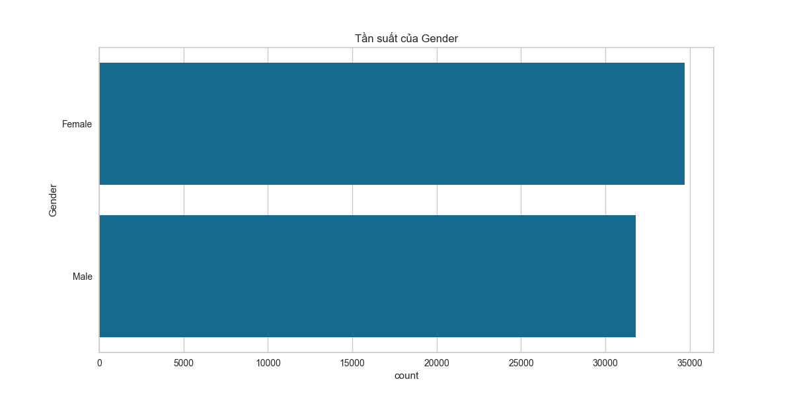
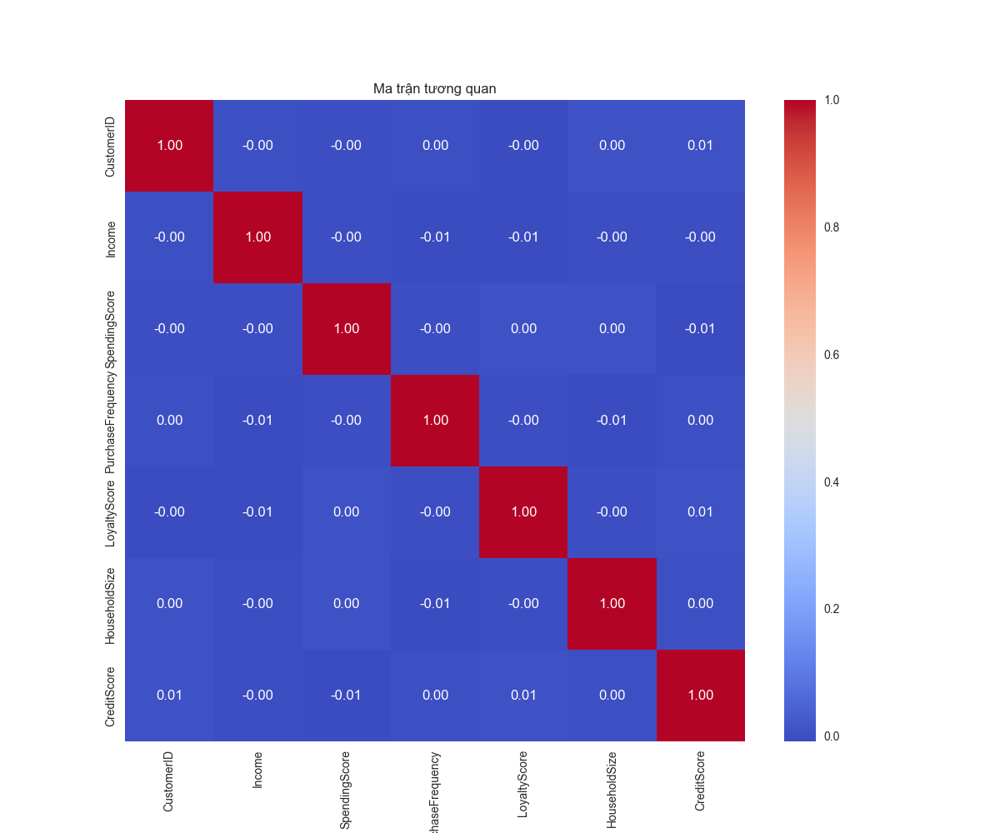

# Phân tích khách hàng với t-SNE và K-means

Dự án phân tích và phân khúc khách hàng sử dụng kỹ thuật giảm chiều dữ liệu t-SNE kết hợp với thuật toán phân cụm K-means.

## Giới thiệu

Dự án này áp dụng kỹ thuật giảm chiều dữ liệu t-SNE (t-distributed Stochastic Neighbor Embedding) kết hợp với thuật toán phân cụm K-means để phân tích dữ liệu khách hàng São Paulo. Mục tiêu chính là phân khúc khách hàng thành các nhóm có đặc điểm tương đồng, từ đó giúp doanh nghiệp hiểu rõ hơn về khách hàng và đưa ra các chiến lược marketing phù hợp.

Ứng dụng web được phát triển bằng Flask cung cấp một giao diện trực quan để thực hiện toàn bộ quy trình phân tích dữ liệu từ tiền xử lý đến phân cụm và trực quan hóa kết quả. Người dùng có thể:
- Thực hiện tiền xử lý dữ liệu tự động với các kỹ thuật xử lý giá trị thiếu, phát hiện ngoại lai và chuẩn hóa
- So sánh hiệu quả của hai phương pháp giảm chiều dữ liệu: t-SNE và PCA
- Phân cụm khách hàng với K-means và tự động tìm số cụm tối ưu
- Trực quan hóa kết quả phân cụm với các biểu đồ tương tác
- Phân tích đặc điểm của từng phân khúc khách hàng
- Tải xuống kết quả phân khúc để sử dụng trong các phân tích tiếp theo

## Cấu trúc dự án

```
CustomerSegmentation_TSNE/
│
├── app.py                      # Ứng dụng Flask chính
├── data_preprocessing.py       # Module tiền xử lý dữ liệu
├── clustering.py               # Module phân cụm với t-SNE và K-means
├── requirements.txt            # Các thư viện cần thiết
│
├── static/                     # Thư mục chứa tài nguyên tĩnh
│   ├── images/                 # Thư mục chứa hình ảnh
│   │   ├── eda/                # Biểu đồ phân tích dữ liệu
│   │   └── clustering/         # Biểu đồ phân cụm
│
├── templates/                  # Thư mục chứa các template HTML
│   ├── base.html               # Template cơ sở
│   ├── index.html              # Trang chủ
│   ├── preprocess.html         # Trang tiền xử lý dữ liệu
│   ├── preprocessing_results.html  # Trang kết quả tiền xử lý
│   ├── clustering.html         # Trang phân cụm
│   ├── clustering_results.html # Trang kết quả phân cụm
│   ├── compare_methods.html    # Trang so sánh phương pháp
│   └── about.html              # Trang giới thiệu
│
└── models/                     # Thư mục chứa các mô hình đã huấn luyện
```

## Cài đặt

1. Clone repository:

```bash
git clone <repository-url>
cd CustomerSegmentation_TSNE
```

2. Tạo môi trường ảo và kích hoạt:

```bash
python -m venv .venv
.venv\Scripts\activate
```

3. Cài đặt các thư viện cần thiết:

```bash
pip install -r requirements.txt
```

## Sử dụng

1. Khởi động ứng dụng:

```bash
python app.py
```

2. Mở trình duyệt và truy cập:

```
http://localhost:5000
```

3. Các bước thực hiện:
   - Tiền xử lý dữ liệu
   - Phân cụm với t-SNE và K-means
   - Xem kết quả phân cụm
   - So sánh t-SNE và PCA

## Các kỹ thuật được sử dụng

- **Tiền xử lý dữ liệu**:
  - Làm sạch dữ liệu và xử lý giá trị thiếu với KNN Imputer
  - Phát hiện và xử lý ngoại lai với Isolation Forest
  - Mã hóa đặc trưng phân loại với One-Hot Encoding
  - Chuẩn hóa đặc trưng số với StandardScaler

- **Giảm chiều dữ liệu**:
  - t-SNE (t-distributed Stochastic Neighbor Embedding)
  - PCA (Principal Component Analysis)

- **Phân cụm**:
  - K-means
  - Tìm số cụm tối ưu với Silhouette Score và Elbow Method

- **Đánh giá**:
  - Silhouette Score
  - Davies-Bouldin Index
  - Calinski-Harabasz Index

- **Trực quan hóa**:
  - Plotly cho biểu đồ tương tác
  - Matplotlib và Seaborn cho biểu đồ tĩnh

## Yêu cầu hệ thống

- Python 3.8+
- Các thư viện trong requirements.txt

## Demo kết quả

### Phân tích khám phá dữ liệu (EDA)

Ứng dụng thực hiện phân tích khám phá dữ liệu để hiểu rõ hơn về đặc điểm của dữ liệu khách hàng:

#### Phân phối của các thuộc tính số


#### Tần suất của các thuộc tính phân loại




#### Ma trận tương quan



### Kết quả phân cụm

#### So sánh t-SNE và PCA


Biểu đồ trên cho thấy sự so sánh hiệu quả giữa t-SNE và PCA trong việc phân cụm khách hàng. t-SNE thường tạo ra các cụm phân tách rõ ràng hơn, trong khi PCA cung cấp thông tin về phương sai giải thích được.

#### Biểu đồ Scree Plot của PCA


Biểu đồ Scree Plot cho thấy tỷ lệ phương sai giải thích được của từng thành phần chính trong PCA. Điều này giúp xác định số lượng thành phần chính cần giữ lại.

#### Đặc điểm của các cụm khách hàng


Biểu đồ nhiệt (heatmap) trên hiển thị đặc điểm của từng cụm khách hàng, giúp doanh nghiệp hiểu rõ hơn về các phân khúc khách hàng khác nhau.

#### Silhouette Score


Biểu đồ Silhouette Score giúp đánh giá chất lượng phân cụm và xác định số cụm tối ưu.

## Tác giả

Đồ án Khai phá dữ liệu - Ứng dụng kỹ thuật giảm chiều dữ liệu bằng t-SNE trong phân tích dữ liệu khách hàng
